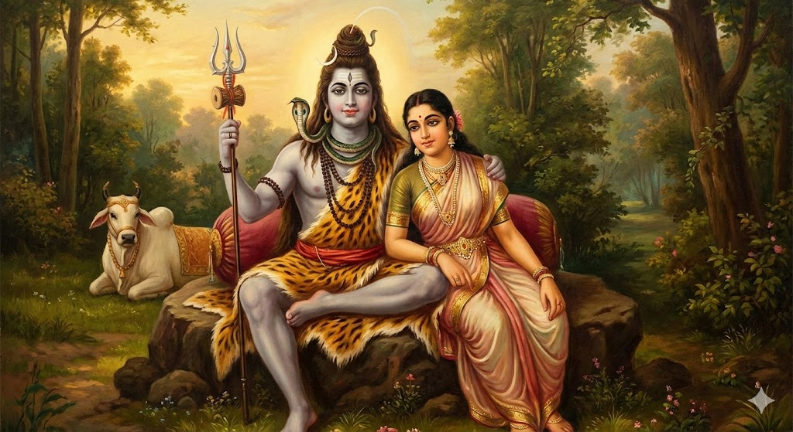
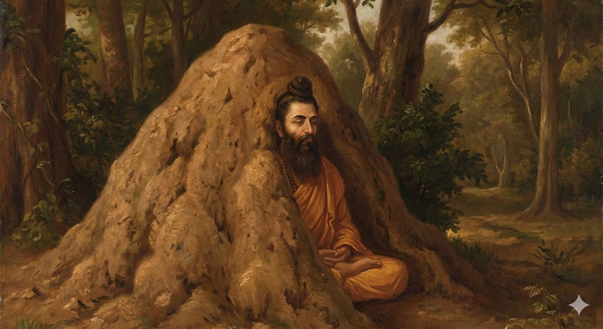
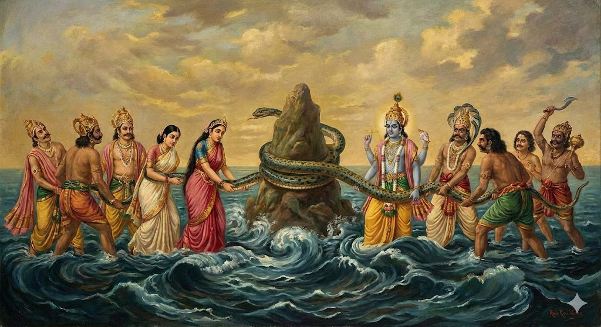

# Ramcharitmanas

## Opening Prayers

The poet begins by honoring the gods, teachers, and divine beings who make all good things possible.

I bow to Saraswati, the goddess of speech, and to Ganesha, the elephant-headed god. They give us letters and meaning. They give us feeling and rhythm. They bring all good beginnings. Shloka 1

I bow to Shiva and Parvati. They are faith and trust in living form. Without these two, even the greatest seekers cannot see God in their own hearts. Shloka 2

Long ago, the moon was cursed for showing favor to one wife and neglecting the others. He would fade away, growing thinner until he vanished completely. Terrified, the dying moon searched the universe for someone who could save him. He came to Shiva, who took pity on him. Instead of curing the curse completely, Shiva did something unexpected - he placed the flawed, fading moon on his own head, making it part of himself. From that day on, the moon waxes and wanes but never dies. And because it rests on Shiva's head, the whole world honors that crooked, spotted moon as sacred. The teaching is this: when a true teacher accepts you, even your flaws become beautiful.

I bow to my teacher, who is pure wisdom and forever true. He is like Shiva himself. The moon is crooked and spotted, but because it found shelter with Shiva, the whole world worships it. When you have a great teacher, even your flaws become beautiful. Shloka 3

The first poet of the Ramayana was not born a poet. He was born Ratnakar, a highway robber who lived by stealing and killing. One day, he stopped a group of wandering sages to rob them. But before he could strike, they asked him a simple question: "You do this for your family. But will your family share in the sins you are gathering?" He ran home to ask. His wife said no. His children said no. His old parents said no. "We take what you bring," they said, "but your sins are your own." His heart broke open. He ran back to the sages and fell at their feet. They taught him to sit and repeat one word: Rama. He sat so still that years passed. An anthill grew over his body. When he finally emerged, transformed, the sages gave him a new name: Valmiki, "the one who came from the anthill." This reformed robber became the first poet and wrote the original Ramayana. Hanuman, the great monkey, had his own transformation - he was born with incredible powers but forgot them entirely. It took the memory of devotion to awaken what he truly was. Both spent their lives walking through the garden of Rama's story.

I bow to the first poet who wrote Rama's story and to Hanuman, the great monkey. Both are wise. Both are pure. Both love to walk through the garden of Sita and Rama's goodness. Shloka 4

I bow to Sita, beloved of Rama. She creates, protects, and transforms everything. She takes away all suffering. She brings all good fortune. Shloka 5

The whole world dances under the spell of his magic - even the creator god and all the other gods and demons. Because of him, this world seems real, like mistaking a rope for a snake in dim light. His feet alone are the boat for those who want to cross the ocean of birth and death. I bow to that Lord, called Rama, who is the cause behind all causes and greater than everything. Shloka 6

What many holy books agree on, what the ancient Ramayana tells, and what I have gathered from other places too - I, Tulsidas, now weave together in beautiful simple language. I do this for the joy of my own heart. Shloka 7

## Calling on Ganesha and the Lord

The poet asks for blessings from those whose very remembrance brings success.

Think of him and every task succeeds. He is the lord of all good spirits. He has the face of a noble elephant. He is a treasure of wisdom and a home for good qualities. May that Ganesha bless me. Soratha 1

His grace can make a silent person speak beautifully. His grace can help a lame person climb the highest mountain. He burns away all the troubles of this dark age. May that kind one look at me with love. Soratha 2

At the edge of the world lies a vast ocean made of milk. In its waters, the great serpent Shesha floats with a thousand hoods, and upon those coils rests Vishnu, the preserver of all creation. He sleeps there in perfect peace while the universe turns. Once, the gods and demons wanted something hidden deep in that milky sea: the nectar of immortality. So they agreed to work together, using a mountain as a churning rod and the great serpent as a rope. But the mountain began to sink. So Vishnu dove into the depths and became a giant tortoise, placing the mountain on his shell. Many wonders rose up from that ocean - the moon, a wish-granting tree, the goddess of wealth. But so did a terrible poison. Shiva scooped it up and drank it; Parvati pressed her hand against his throat so it wouldn't go down, and it stayed there, turning his throat blue forever. Finally the nectar appeared. Through all this, Vishnu watched and helped - first as the tortoise below, then returning to rest on those milky waters. He is still there, calm and eternal.

His body is dark blue like a fresh lotus. His eyes are like red lotuses in full bloom. He rests forever on the ocean of milk. May that Lord make his home in my heart. Soratha 3

Shiva, the great ascetic, sat in deep meditation for ages. The gods needed him to marry Parvati, but how could anyone disturb his focus? They sent Kamadeva, the god of love, armed with his bow of sugarcane and arrows tipped with flowers. Kamadeva hid behind a tree and shot his most powerful arrow at Shiva's heart. Shiva's concentration broke. For one instant, he felt the sting of desire. Then rage replaced it. Shiva opened his third eye - the eye of fire - and a single glance reduced Kamadeva to ash. The god of love himself was destroyed. And yet, this same fierce Shiva who burned desire itself is gentle beyond measure with those who come to him with simple hearts. He wears ash on his body, lives among cremation grounds, and welcomes anyone, no matter how low or broken. The destroyer of desire is also the ocean of compassion.

His body is white like jasmine flowers and the moon. He is Parvati's beloved and an ocean of kindness. He loves those who have nothing. May he be kind to me - he who burned the god of love to ash. Soratha 4

I bow at the lotus feet of my teacher. He is an ocean of grace. He is God himself in human form. His words are like rays of sunlight that scatter the thick darkness of ignorance. Soratha 5

## Praise of the Teacher

Tulsidas speaks of the transforming power of a true teacher's grace.

I bow to the dust of my teacher's feet. It has a lovely taste, a sweet fragrance, and is full of devotion. It is like a beautiful powder made from the root of immortality. It destroys the whole family of worldly diseases. Chaupai 1

That dust is like the sacred ash on Shiva's body - worn by those who have earned good fortune. It gives birth to beauty, blessing, and joy. It removes the dirt from the mirror of a devotee's mind. When applied as a mark on the forehead, it brings all good qualities under your influence. Chaupai 2

The light from my teacher's toenails shines like gems. When you remember it, divine sight awakens in your heart. That light destroys the darkness of ignorance. Whoever receives it in their heart is truly fortunate. Chaupai 3

When that light enters, the pure eyes of the heart open. The sorrows and faults of this night-like world disappear. Then you begin to see the jewels of Rama's story everywhere - some hidden, some open, each in its own mine. Chaupai 4

In the old stories, there was a special ointment called siddhanjanam - the paste of the perfected ones. If you rubbed even a little on your eyelids, your vision would change completely. You would suddenly see what was always there but hidden: buried gold beneath ordinary ground, gems glittering inside plain mountains, treasures that people walked over every day without knowing. Seekers and wise ones would apply this ointment and then look at the world - what seemed like an ordinary hillside was actually full of diamonds. The poet says a true teacher's grace works exactly like this ointment. Before you meet your teacher, you walk through the world seeing nothing special. After receiving the teacher's blessing, suddenly the hidden treasures of Rama's story appear everywhere.

It is like applying a magic ointment to your eyes. Seekers and wise ones use it and suddenly see hidden treasures inside mountains, beneath forests, all over the earth. The dust from a true teacher's feet works the same way - what was always there but invisible now shines forth. Doha 1

The dust of my teacher's feet is a soft and lovely ointment for the eyes - nectar that destroys all defects of vision. Using it, I clean the eyes of wisdom. Then I tell Rama's story, which frees us from the world's chains. Chaupai 5

## Honoring the Holy and the Good

The poet bows to the learned and to saints, explaining their quiet power.

First I bow at the feet of the learned ones, the gods of the earth. They remove all doubts born of confusion. Then with loving words I bow to the community of good people, who are a mine of all virtues. Chaupai 6

Think about the cotton plant. Its fruit is not sweet - there is no pleasant juice to taste. It looks plain and ordinary. But inside it grows soft, useful threads. Those threads are spun into cloth, and cloth covers people's nakedness, protects their dignity, hides what would shame them. Now think about how the cotton plant must live to produce this gift - it grows in difficult soil, endures heat and drought, and quietly bears its hard life without complaint. A saint is exactly like this. A saint lives simply, without pleasures, without fanfare. When troubles come, a saint bears them quietly. And when a saint sees someone's faults or shame - instead of exposing them for all to see - a saint covers them up, the way cloth covers the body. This is why saints are so deeply honored: not for what they show, but for what they hide.

A saint's life is like a cotton plant. Its fruit has no sweet juice. It looks plain. But inside it is full of soft, useful threads. Those threads become cloth that covers people's shame. A saint lives simply, bears troubles quietly, and when he sees someone's faults, he covers them up instead of exposing them. This is why the world honors him. Chaupai 7

The gathering of saints is full of joy and blessing. It is like a walking holy pilgrimage site. In it, devotion to Rama flows like the sacred Ganga river. Thinking deeply about truth flows like another holy river. Chaupai 8

The stories of what to do and what not to do flow like the river that washes away sins. The tales of Vishnu and Shiva sit beautifully together like three rivers meeting. Hearing them gives all happiness and good fortune. Chaupai 9

Steady faith in one's own duty is like the undying banyan tree at that holy place. Good actions are its surroundings. This sacred gathering of saints can be found in any country, at any time, by anyone. When served with respect, it destroys all sorrows. Chaupai 10

This holy place is beyond words, beyond this world. Its power shows itself right away. Chaupai 11

Those who hear and understand its glory with a happy heart, who bathe in it with great love - they gain all four rewards of life even while still alive: purpose, prosperity, pleasure, and freedom. Doha 2

## The Power of Good Company

Tulsidas explains how being around the right people can transform anyone.

See the results of bathing there right away. Crows become cuckoos. Herons become swans. Hear this and do not be surprised. The glory of good company is no secret. Chaupai 12

Valmiki, the first poet, was once a highway robber named Ratnakar. Narada, the wandering sage, was once just an ordinary being before devotion transformed him. Agastya, the great hermit who could drink oceans, had his own journey from ordinary to extraordinary. Each has told their story in their own words.

The first poet, the wandering saint, and the wise hermit have each told their own story through their own lips. Think of all living beings in water, on land, in the sky - all the conscious and unconscious creatures in this world. Chaupai 13

Whenever any of them gained wisdom, fame, a good path, prosperity, or goodness - however they got it, wherever they got it - know that it came from the power of good company. In the scriptures and in life, there is no other way. Chaupai 14

Without good company, wisdom does not arise. Without Rama's grace, good company is hard to find. Good company is the root of all joy and blessing. Getting that company is the fruit. All other efforts are just flowers. Chaupai 15

There is a stone called the philosopher's stone - if ordinary iron touches it, even for a moment, that iron transforms into gold. Not gold-colored, not gold-like - actual gold. But here is another wonder: there is a jewel that lives in the hood of a poisonous cobra, called the mani, the serpent's gem. Night after night, it rests inches from the snake's venom. And yet the gem never absorbs the poison - it keeps shining, keeps giving light, no matter how long it lives with that which kills. Wicked people become good through good company, like iron turning to gold. But if by some twist of fate a good person falls into bad company, he is like that gem - the poison cannot enter him. He continues to shine by his own nature.

Wicked people become good through good company, just as iron becomes gold by touching the philosopher's stone. But if by some twist of fate a good person falls into bad company, he still follows his own nature - like the gem in a serpent's hood. Though it lives with the poisonous snake, the jewel keeps its light and does not absorb the poison. Chaupai 16

Even the creator god, Vishnu, Shiva, poets, and scholars hesitate when speaking of the greatness of saints. How can I describe it? I am like a vegetable seller trying to talk about the qualities of precious gems. Chaupai 17

Imagine holding a handful of flowers. You cup your palms together and someone places beautiful, fragrant blossoms in your hands. Now think: which hand deserves the fragrance? The left hand or the right? One hand plucked the flowers from the branch. One hand received them gently. Both hands are now equally sweet-smelling. Saints are like these flowers - they do not ask who helped them and who hurt them. They bless everyone with the same sweet fragrance. Those who harm them and those who serve them both receive grace. There is no revenge, no favoritism - just fragrance flowing equally in all directions.

I bow to the saints, whose minds are balanced. They have no friend or enemy. They are like beautiful flowers held in cupped hands. The hand that plucked the flower and the hand that holds it both receive the same sweet fragrance. So too, saints bless everyone equally - those who hurt them and those who help them. Doha 3a

Saints have simple hearts. They care for the world's good. Knowing their nature and their love, I make this request: please hear my humble words and be kind. Give me love for Rama's feet. Doha 3b

## On Bad People

A surprisingly honest look at those who cause harm. Tulsidas bows even to them - partly out of humility, partly with sharp wit.

Now I bow with a true heart even to wicked people. They work against even those who help them, for no reason at all. They see profit only in harming others. They are happy when others fail and sad when others do well. Chaupai 18

When the gods and demons churned the ocean of milk, many wonders emerged. Finally came what they all wanted: the nectar of immortality. The gods lined up to receive it. But one clever demon disguised himself to look like a god and slipped into the line, sitting quietly between the Sun and the Moon, waiting for his turn. The nectar touched his lips. But the Sun and Moon recognized him and cried out to Vishnu: "Imposter!" Vishnu's discus flew through the air and sliced through the demon's neck. But it was too late - the nectar had already passed his lips. His head became immortal, though his body died. Now that demon's head floats eternally through the sky, filled with rage at the Sun and Moon who exposed him. He chases them across the heavens. When he catches one, he swallows it - this is what we call an eclipse. But since he has no body anymore, they slide right out through his severed neck and shine again. His name is Rahu. To this day, he tries to swallow the light.

They try to block the good name of God, just like Rahu the eclipse demon tries to swallow the full moon. Bad people are great warriors when it comes to ruining others. They look for people's faults with a thousand eyes. Their minds are like flies near good food - the fly lands in clarified butter, spoils it, and dies itself. Wicked people destroy others' good work and hurt themselves in the process. Chaupai 19

Kumbhakarna was the brother of Ravana, the ten-headed demon king. He was a giant of terrifying power - when he walked, the earth shook. He once performed intense austerities to earn a wish from the gods. He meant to ask for "Indrasana" - the throne of Indra, king of heaven. But the goddess of speech, Saraswati, saw the danger. At the moment he opened his mouth to speak, she twisted his tongue. Instead of "Indrasana," he said "Nidrasana" - a bed of sleep. The creator god smiled and granted the wish immediately. Kumbhakarna was doomed to sleep for six months at a time. Only for one day would he wake, eat like a monster, and then fall back into slumber. When the war finally came and Ravana desperately needed his brother, servants had to pound drums in his ears, march elephants over his body, and pour rivers of blood into his mouth just to wake him. The world was safer when Kumbhakarna slept. Some people are like this - their unconsciousness is everyone else's good fortune.

In their burning heat they are like fire. In their anger they are like the god of death. In hoarding sins and faults they are as rich as the god of wealth. Their rise is like a comet - it signals trouble for everyone. It is best when they sleep deeply like Kumbhakarna who slept for six months at a time. Some people are like this. Their sleeping is a blessing for everyone. Chaupai 20

They would give up their own bodies to ruin someone else, like hailstones that destroy crops and then melt away. I bow to such wicked people as if they were the thousand-headed serpent - they use a thousand mouths to angrily describe the faults of others. Chaupai 21

There is a clever joke hidden in what follows. The poet bows to wicked people as if they were Indra, the king of heaven. Indra has an "army of gods" (sura-anik) that fights for righteousness. But the same sound - sura-anik - can also mean "wine is dear." So when Tulsidas salutes wicked people like Indra and mentions suranik, he is making a pun. Indra leads divine armies into noble battle. These wicked people just stumble into fights because they are drunk. Same word, two meanings. The surface praises them; the depth mocks them.

Again I bow to them as if to an ancient king who wished for ten thousand ears - they use ten thousand ears to hear about other people's sins. I salute them like Indra, the king of gods - for whom the army of gods is dear, or perhaps just wine is dear. Chaupai 22

Harsh words are their favorite weapon. With a thousand eyes they search for others' flaws. Chaupai 23

This is the way of wicked people: they burn with jealousy when they hear of anyone's good fortune - whether stranger, enemy, or friend. Knowing this, I fold both my hands and humbly request them with love. Doha 4

I have done my part by asking politely. But they will never change their ways. You may raise crows with great affection. Will they ever stop eating flesh? Chaupai 24

## Saints and Sinners Compared

Tulsidas explores what makes the good different from the bad - both born in the same world.

Now I bow to the feet of both saints and sinners. Both give pain, but there is a difference. One causes pain when you must part from them. The other causes pain just by meeting them. Chaupai 25

Think of a pond. In that same water, two very different things are born on the same day: a lotus flower and a leech. They share the same origin, the same water, the same sunlight. Yet look at how differently they turn out. The lotus is beautiful to see, soft to touch. Looking at it brings peace. The leech clings to your skin and drinks your blood. Saints and sinners are born into the same world - they breathe the same air, walk the same earth. But like the lotus and the leech, their natures are opposite. Saints are like nectar - they free you from death, from the endless cycle of suffering. Sinners are like wine - they cloud your mind, make you forget yourself, leave you confused and heavy. Both nectar and wine emerged from the same churning of the great ocean. Both saints and sinners emerge from the same churning of life.

Both are born together in this world. But like the lotus and the leech born in the same water, their qualities are different. The lotus delights the eye and is soft to touch. The leech clings and drinks your blood. Saints are like nectar - they free you from death. Sinners are like wine - they bring confusion and dullness. Both come from the same deep ocean of the world. Chaupai 26

Good and bad earn their own rewards through their own deeds - one gains a good name, the other shame. Nectar, the moon, the Ganga, and saints belong together. Poison, fire, the river of sin, and hunters belong together. Everyone knows the difference between these. But people love what suits their taste. Chaupai 27

A good person chooses goodness. A low person clings to lowness. Nectar is praised for giving life. Poison is praised for bringing death. Doha 5

## Why the Poet Speaks of Both

A reason for naming both good and bad qualities.

The sins of the wicked and the virtues of the good - both are like endless, bottomless oceans. That is why I have described some qualities and some faults. Without knowing them, how can one choose what to hold and what to leave? Chaupai 28

The creator made both good and bad. The scriptures separated them by counting their qualities and faults. The holy books say this creation is mixed with both. Chaupai 29

Pain and pleasure, sin and virtue, day and night. Saints and sinners, noble birth and low birth. Demons and gods, high and low. Nectar and poison, life and death. Illusion and truth, the soul and the Lord. Wealth and poverty, the beggar and the king. The holiest city and an unholy land. The sacred Ganga and a river of sin. A great desert and a rich green country. A holy priest and a cruel butcher. Heaven and hell, attachment and freedom. The scriptures have divided them all by their qualities and faults. Chaupai 30-32

A swan has a legendary ability - if you mix milk and water together, the swan can drink just the milk and leave the water behind. It separates what is nourishing from what is diluted.

The creator made this world of matter and mind full of good and bad. Saints are like swans. A swan can separate milk from water when they are mixed - it drinks the milk and leaves the water. Saints take the good and leave the bad. Doha 6

## Bowing to All Creation

The poet humbles himself before every living being, seeing Rama in all.

When the creator gives this kind of swan-like wisdom, the mind leaves faults behind and becomes devoted to virtues. But because of time, nature, and the force of past actions, even good people sometimes slip from goodness when caught by illusion. Chaupai 33

Those devoted to God quickly correct their mistakes. They crush sorrow and fault and spread pure fame. Even wicked people sometimes do good when they find good company. But their deeply stained nature does not go away. Chaupai 34

Rama's brother Lakshmana lay dying on the battlefield. A terrible weapon had struck him down. The only cure was a rare herb that grew on a distant mountain, and it had to arrive before dawn or he would die. Hanuman flew through the night sky to fetch it. The demon king Ravana grew desperate - if Lakshmana was healed, his army would be destroyed. So he sent a demon named Kalanemi to stop Hanuman. Kalanemi was cunning. He transformed himself into a peaceful sage and sat by a beautiful lake along Hanuman's path. When Hanuman landed to ask for directions, the disguised demon spoke gently: "You look tired, friend. Rest here. Drink some water." It was a trap - the water was enchanted, the hospitality was poison. But Hanuman sensed something wrong. The sage's kindness felt hollow. Hanuman grabbed him - and the disguise fell away, revealing the demon beneath. With one blow, Hanuman killed the imposter. Then he flew on. The herb arrived in time. Lakshmana was saved. The lesson: you can wear holy robes and speak gentle words, but truth has a way of grabbing you and tearing off your mask.

Some imposters dress like holy men, and the world honors them for their appearance. But in the end they are exposed. Their deceit does not last, just as the trickery of Kalanemi, Ravana, and Rahu did not last. Chaupai 35

Jambavan was ancient beyond measure. He had lived since the beginning of creation, had circled the creator god Brahma seven times when the universe was still young, and remembered things from before most gods were born. By the time of Rama's story, Jambavan was gray and slow, his body worn down by countless ages. He looked like nothing more than a tired old bear. No one would glance twice at him. But inside that rough exterior was wisdom from the beginning of time. When Rama's army stood at the ocean shore, needing someone to leap across to Lanka, everyone despaired. The distance was impossible. It was Jambavan who remembered what everyone else had forgotten - including Hanuman himself. "You can do this," the ancient bear told the monkey. "You have powers you don't remember. You crossed the sky when you were a child. You just forgot what you are." And Hanuman remembered. And Hanuman flew. The roughest-looking creature in the entire army carried the deepest knowing. This is why true saints are honored no matter what they look like on the outside.

Even with a rough appearance, a true saint is honored, just as the old bear king Jambavan and Hanuman are honored in the world. The loss from bad company and the gain from good company are known everywhere - in daily life and in the scriptures. Chaupai 36

Dust rises to the sky in the company of wind. The same dust becomes mud in the company of water flowing low. A parrot in a saint's house learns to say "Rama, Rama." A parrot in a sinner's house learns to curse. Chaupai 37

In bad company, smoke becomes black soot. In good company, that same smoke becomes ink for writing holy books. When smoke joins water, fire, and wind, it becomes a rain cloud that gives life to the world. Chaupai 38

Planets, medicines, water, wind, and cloth - all become harmful or helpful depending on their association. Thoughtful people understand this. Doha 7a

The bright half and dark half of the moon have the same amount of light. But people named them differently. One is called the moon's growth, the other its fading. One gets praise, the other blame. Doha 7b

All beings in the world - still or moving - I know them all to be filled with Rama. With folded hands, I bow to the feet of all. Doha 7c

Gods, demons, humans, serpents, birds, ghosts, ancestors, heavenly musicians, and spirits of the night - I bow to you all. Please be kind to me now. Doha 7d

Beings born from sweat, eggs, earth, and womb - all eighty-four hundred thousand kinds living in water, on land, and in the sky - I see them all as Sita and Rama. With folded hands I bow to them. Chaupai 39

Knowing me as your servant, you who are oceans of kindness - please be gracious to me. Drop all pretense and show me love. I have no confidence in my own strength or mind. That is why I ask everyone. Chaupai 40

## The Poet's Humility

Tulsidas admits his own weakness but reveals his one great hope.

I wish to sing the story of Rama. But my mind is small and his story is an ocean without end. I cannot think of even one way forward. My mind and thoughts are beggars. My desire is a king. Chaupai 41

My ability is very low, but my wish is very high. I long for nectar, but I cannot even find buttermilk in this world. Good people will forgive my boldness. Like parents enjoying a child's babbling, they will listen with affection. Chaupai 42

When a small child speaks in broken sounds, father and mother listen with delighted hearts. But the cruel and crooked will laugh - those who wear others' faults like ornaments. Chaupai 43

Who does not like their own poems - whether sweet or flat? But rare are the noble souls who feel joy when hearing someone else's words. Chaupai 44

Most people in this world are like ponds and rivers. They swell only with their own rising waters. A true saint is rare like the ocean. When the ocean sees the full moon, it rises with joy. The moon is not part of the ocean, yet the ocean celebrates its fullness. Chaupai 45

My fortune is small, my desire is great. But I have one faith: all good people will find joy in hearing this, and wicked people will laugh. Doha 8

Let the wicked laugh. Even their laughter helps me. Crows call the sweet-voiced cuckoo harsh. Herons laugh at swans. Frogs laugh at the rainbird who drinks only pure drops from the sky. The impure always mock what is pure. Chaupai 46

Those who have no love for poetry and no feeling for Rama's feet - this story will taste flat to them. But for those who love the feet of Vishnu and Shiva, who do not argue about which is higher - for them this story will be sweet. Chaupai 47

Good people know that this story is adorned with devotion to Rama. They will listen and speak well of it. I am no poet. I have no skill with words. I lack all arts and learning. Chaupai 48

There are many kinds of letters, meanings, and decorations in poetry. There are many forms of verse and composition. There are endless types of moods and feelings. Poetry has countless merits and faults. Chaupai 49

I do not have even one understanding of these things. I write this on blank paper as honest truth. Chaupai 50

## The Glory of Rama's Name

The poet reveals the one jewel that makes everything shine.

My poetry lacks all merit. But there is one quality known throughout the world. Thinking of that, wise people with clear understanding will listen. Doha 9

In this poetry is the generous name of Rama. That name is the purest essence of all scriptures. It is the home of all blessings and the remover of all misfortune. Shiva himself, together with Parvati, always chants it. Chaupai 51

Even wonderful poetry by a great poet does not shine without Rama's name. A beautiful moon-faced woman, dressed in every ornament, still needs clothes to look complete. Chaupai 52

On the other hand, even poor verses by a weak poet, if marked with Rama's name and glory, are spoken and heard with respect by the wise. Saints are like bees - they seek only the essence of goodness. Chaupai 53

Though my poetry has no flavor, the power of Rama shines through it. This is my only confidence. Who has not gained greatness through good company? Chaupai 54

Even smoke gives up its natural bitterness when it joins the fragrant aloewood, and becomes sweet-smelling. My style may be rough, but I describe something beautiful: the story of Rama, which brings blessing to the world. Chaupai 55

This story of Rama brings blessing and removes the stains of this dark age. The flow of this poor poetry is crooked, like the flow of a sacred river - but the water is pure. Through the company of Rama's glory, these verses will become beautiful and pleasing to good hearts. Even the ash of a cremation ground becomes lovely and sacred when it rests on Shiva's body. Chhand

Because of its connection to Rama's glory, my poetry will become dear to everyone. Sandalwood trees grow on a certain mountain. Any ordinary wood that grows there also becomes fragrant and worthy of worship. Does anyone then care that it was just common wood? Doha 10a

A black cow gives bright white milk, full of goodness. Knowing this, everyone drinks it. In the same way, though my language is rough and rural, wise people will happily sing and hear the glory of Sita and Rama. Doha 10b

## Poetry Finds Its Glory in God

Tulsidas reflects on how gems find their glory in the right setting, and how poetry finds its glory when it speaks of God.

Gems and pearls have great beauty. But they do not shine on the head of a snake or an elephant or a mountain. They shine best on a king's crown or a young woman's body. The right setting brings out their full glory. Chaupai 1

Good poetry is the same way. It is born in one place and finds its beauty in another. A poem shines when people receive it, discuss it, and follow the ideals it speaks of. When a poet with true devotion remembers Saraswati, she leaves even the creator god's home and comes running to help. Chaupai 2

But her tiredness from running so far cannot be healed by any ordinary remedy. Only a bath in the lake of Rama's story can refresh her. Knowing this, wise poets sing the glory of God. His story washes away all the troubles of this dark age. Chaupai 3

When someone uses Saraswati's gift to praise ordinary worldly people, she beats her head in regret. She thinks, "Why did I come when this person called?" Chaupai 4

In India there is an ancient belief about pearls. They say that when the Swati star appears in the monsoon sky, something magical can happen. If a single raindrop falls at just that moment into an open oyster shell floating in the ocean, that raindrop transforms into a pearl. Not just any rain, not just any time - the Swati star must be shining, the shell must be open and waiting. When these come together, something ordinary becomes something precious. Tulsidas uses this as a way to understand how poetry is born: the heart is like the ocean, vast and deep; the mind is like the oyster shell, which can open or close; divine inspiration is like the Swati star, appearing in its own time. When good thoughts rain down from that star into an open and ready mind, beautiful poetry forms like pearls in the shell.

Wise people say the heart is like the ocean. The mind is like an oyster shell. Divine inspiration is like the Swati star. When good thoughts rain down like water from that star into an open mind, beautiful poetry forms like pearls in the shell. Chaupai 5

These pearl-poems are then strung together with skill on the beautiful thread of Rama's story. Good people wear this necklace on their pure hearts. It fills them with deep love. Doha 11
